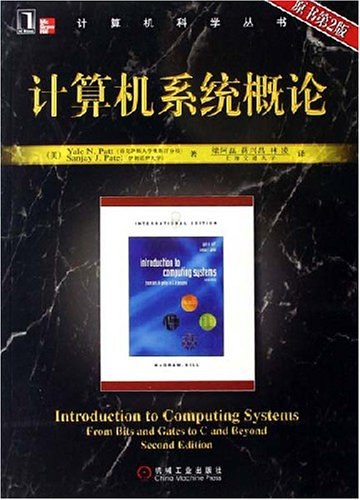

<h1 align="center">程序员必读书单</h1>

## 面向读者
这份书单涵盖了软件开发各个关键领域的必读书籍，它可以满足绝大多数程序员的学习需求，无论你是初学者，还是进阶者，都可以从中获益。

## 书籍下载
点击每本书名下方的百度网盘链接，即可跳转到百度网盘下载此书。每本书籍都会尽量提供中文版和英文版。

**[一键领取全部书籍](#全套下载)**

## 甄选标准
优秀的程序员应该具备两方面能力：

**1.良好的程序设计能力**

* 理解计算机科学的核心概念（计算机系统结构、操作系统、编译原理、计算机网络等）
* 熟悉至少两门以上编程语言（Java、 C++、C#、Python等）
* 掌握常用的数据结构和算法（堆、栈、队列、链表、排序、散列等）

**2.专业的软件开发素养**

* 具备良好的编程实践，能够编写可测试、可扩展、可维护的代码
* 把握客户需求，按时交付客户所需要的软件产品
* 理解现代软件开发过程中的核心概念

与其它能力一样， 程序设计能力和软件开发素养主要来自项目经验和书本知识。

项目经验因人而异，不同领域的程序员，项目差异会很大，但书本知识是相通的——尤其是经典书籍，它们都能够拓宽程序员的视野，加速程序员的成长。

本文档的目的就是让程序员阅读尽可能少的书籍，获取尽可能多的知识。

书籍选择标准遵循以下原则：

* 必读：学习某项技术，无论如何都不能错过的一本书
* 全面：能够覆盖软件开发中的重要概念
* 通用：适用每位程序员，与特定方向无关

按这三个标准，书单可分为基础理论、编程语言、软件设计、和自我修养四类，每类均由若干概念组成。

## 书单列表

基础理论

*  计算机原理
	* 入门书籍 | 编码：隐匿在计算机软硬件背后的语言
	* 必读书籍 | 深入理解计算机系统
	* 延伸阅读 | 计算机系统概论
*  操作系统
	* 入门书籍 | 鸟哥的Linux私房菜
	* 必读书籍 | 现代操作系统
*  计算机网络
	* 入门书籍 | 计算机网络
	* 必读书籍 | 计算机网络（第五版）
*  编译原理
	* 入门书籍 | 计算机程序的构造和解释
	* 必读书籍 | 编译原理

编程语言

* C
	* 入门书籍 | C 和指针
	* 必读书籍 | C 程序设计语言（第 2 版）
	* 延伸阅读 | C 陷阱与缺陷
* C++
	* 入门书籍 | C++ 程序设计原理与实践
	* 必读书籍 | C++程序设计语言（第 4 版）
	* 延伸阅读 | Effective C++ 
* Java
	* 入门书籍 | Java 核心技术（第9版）
	* 必读书籍 | Effective Java（第 2 版）
	* 延伸阅读 | Java 编程思想
* JavaScript
	* 入门书籍 | JavaScript DOM编程艺术（第2版）
	* 必读书籍 | JavaScript 语言精粹
	* 延伸阅读 | JavaScript 权威指南（第 6 版）
* Python
	* 入门书籍 | Python 基础教程（第二版）
	* 必读书籍 | Python参考手册（第 4 版）
	* 延伸阅读 | Python 编程实战：运用设计模式、并发和程序库创建高质量程序 

软件设计

*  算法与数据结构
	* 入门书籍 | 算法（第4版）
	* 必读书籍 | 编程珠玑（第 2 版）
	* 延伸阅读 | 
*  数据库设计
	* 必读书籍 | Oracle Database 9i/10g/11g 编程艺术
	* 延伸阅读 | 高性能 MySQL
*  设计模式
	* 入门书籍 | Head First设计模式
	* 必读书籍 | 设计模式
	* 延伸阅读 | 算法导论（第 3 版）
*  前端设计
	* 入门书籍 | 写给大家看的设计书 
	* 必读书籍 | 认知与设计：理解 UI 设计准则
	* 延伸阅读 | 界面设计模式（第 2 版）

自我修养

*  代码修养
	* 入门书籍 | 程序员修炼之道：从小工到专家
	* 必读书籍 | 程序员职业素养
	* 延伸阅读 | 暗时间
*  英语能力
	* 入门书籍 | 17天搞定GRE单词
	* 必读书籍 | GRE&GMAT阅读难句教程
	* 延伸阅读 | 经济学人精翻

## 基础理论
本章节主要包括计算机原理、操作系统、计算机网络、编译原理等内容，基本涵盖了程序员应该掌握的计算机基础知识。

### 计算机原理

#### 入门书籍 | 编码：隐匿在计算机软硬件背后的语言

这本书以极其简单有趣的语言为我们构造了一个计算机的大体轮廓，让我们对于计算机运行原理的理解更加完整且通畅。

百度网盘链接

#### 必读书籍 | 深入理解计算机系统

原书名为《Computer Systems A Programmer’s Perspective》，当前最新版为第3版。

本书最大优点是为程序员描述计算机系统的实现细节，帮助其在大脑中构造一个层次型的计算机系统。从最底层的数据在内存中的表示到流水线指令的构成，到虚拟存储器，到编译系统，到动态加载库，到最后的用户态应用。通过掌握程序是如何映射到系统，以及程序是如何执行的，你能够更好地理解程序的运行为什么是这样的，以及效率低下是如何造成的。

#### 延伸阅读 | 计算机系统概论

另一部优秀的计算机系统导论型作品，与《深入理解计算机系统》不同，这本书采用自下而上的方式，从二进制、和数字逻辑这些底层知识一步步过渡到高级编程语言（C），从而以另一种方式理解计算机系统。

### 操作系统

#### 入门书籍 | 鸟哥的Linux私房菜

这本书会让你对计算机和操作系统，以及 Linux 有一个非常全面的了解，并能够管理或是操作好一个 Linux 系统。

百度网盘链接

#### 必读书籍 | 现代操作系统

这本书是操作系统领域的经典之作，书中集中讨论了操作系统的基本原理，包括进程、线程、存储管理、文件系统、输入/输出、死锁等，同时还包含了有关计算机安全、多媒体操作系统、掌上计算机操作系统、微内核、多核处理机上的虚拟机以及操作系统设计等方面的内容。

### 计算机网络

#### 入门书籍 | 计算机网络

这本书采用了独创的自顶向下方法，即从应用层开始沿协议栈向下讲解计算机网络的基本原理，强调应用层范例和应用编程接口，内容深入浅出，注重教学方法，理论与实践相结合，是一本不可多得的教科书。

百度网盘链接

#### 必读书籍 | 计算机网络（第五版）

这本书是国内外使用最广泛、最权威的计算机网络经典教材。全书按照网络协议模型自下而上（物理层、数据链路层、介质访问控制层、网络层、传输层和应用层）有系统地介绍了计算机网络的基本原理，并结合 Internet 给出了大量的协议实例。

这本书还与时俱进地引入了最新的网络技术，包括无线网络、3G 蜂窝网络、RFID 与传感器网络、内容分发与 P2P 网络、流媒体传输与 IP 语音，以及延迟容忍网络等。

另外，本书针对当前网络应用中日益突出的安全问题，用了一整章的篇幅对计算机网络的安全性进行了深入讨论，而且把相关内容与最新网络技术结合起来阐述。

### 编译原理

#### 入门书籍 | 计算机程序的构造和解释

这本书中主要证实了很多程序是怎么构造出来的，以及程序的本质是什么。整本书主要是使用 Scheme/Lisp 语言，从数据抽象、过程抽象、迭代、高阶函数等编程和控制系统复杂性的思想，到数据结构和算法，到编译器/解释器、编程语言设计。

百度网盘链接

#### 必读书籍 | 编译原理

这本书全面、深入地探讨了编译器设计方面的重要主题，包括词法分析、语法分析、语法制导定义和语法制导翻译、运行时刻环境、目标代码生成、代码优化技术、并行性检测以及过程间分析技术，并在相关章节中给出大量的实例。每章中都提供了大量的系统及参考文献。

## 编程语言
编程语言对软件开发至关重要，在此主要选择了 C、C++、Java、Python 及 JavaScript 五门主流编程语言进行介绍。

### C

### C++

### Java

### JavaScript

### Python

## 软件设计
本章节主要包括算法与数据结构、数据库设计、设计模式、界面设计等部分。

### 算法与数据结构

### 数据库设计

### 设计模式

### 界面设计

## 自我修养
软件开发是一项需要不断强化的技能，训练思维方式可以有效的提升学习能力和学习效率。

为了让更多的人了解你的作品，良好的英语能力必不可少。

### 代码修养

### 英语能力

## 他山之石

## 全套下载

全套书籍，可以关注公众号【量子论】，回复「书单」两个字，直接打包下载全部高清电子版。

图一论
图二盘

## 免责声明

书籍全部来自网络，如有侵权，请随时联系，我立刻删除，谢谢。

邮箱：xywang8@126.com

本仓库仅作学习交流分享使用，不作任何商用。
